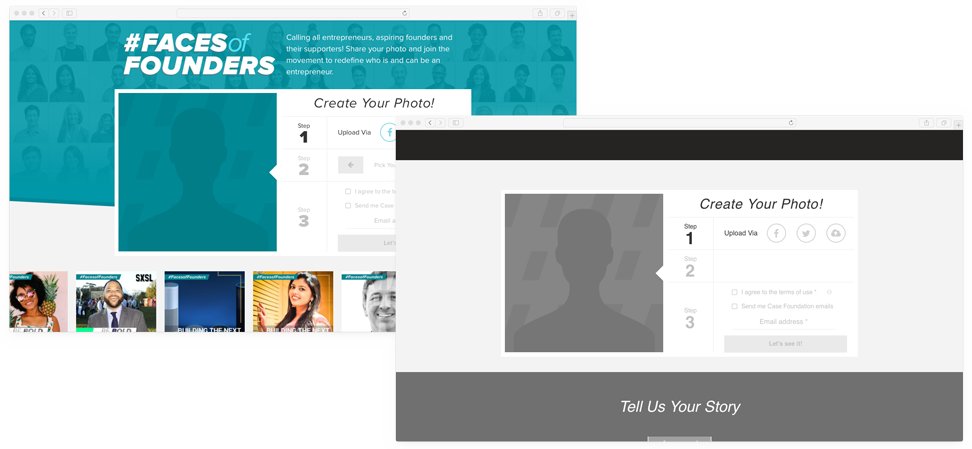

# Case Foundation Judging Platform

## Table of Contents

1. [Background](#background)
2. [Purpose](#purpose)
3. [Setup](#setup)
4. [Use](#use)
6. [Contributing](#contributing)
7. [License](#license)

## Background

America’s startup culture tells us that anyone can bring forward the next big idea. Yet, all too often women entrepreneurs and entrepreneurs of color are left on the sidelines. It’s time to change the narrative of how we talk about entrepreneurs in American culture. It’s time to break down the stereotypes of who can be an entrepreneur and correct the outdated myths of what an entrepreneur can look like.

To address these barriers, the [Case Foundation](http://casefoundation.org/) launched our first-ever [#FacesofFounders](http://www.facesoffounders.org/) campaign in the fall of 2016. The effort, a centerpiece of the Foundation’s inclusive entrepreneur movement, invited entrepreneurs — particularly women founders and entrepreneurs of color — to share their photos and stories of entrepreneurship on FacesofFounders.org or on Twitter using #FacesofFounders. Launched at the White House’s [South by South Lawn](http://casefoundation.org/blog/facesoffounders-launches-white-house-sxsl/) festival, in partnership with Blackstone Charitable Foundation, Google for Entrepreneurs and UBS, along with Fast Company, #FacesofFounders seeks out and lifts up America’s dynamic entrepreneurs who are key to driving innovation and job growth. The winners of the crowdsourced contest, who were reviewed by our panel of forty guest judges, were selected because they are bridging innovation and commitment to inclusiveness. Learn more about the featured stories on [Fast Company](https://www.fastcompany.com/section/faces-of-founders)!

To read more about this campaign, visit [casefoundation.org/facesoffounders](http://casefoundation.org/facesoffounders/).

To see the platform as we used it for #FacesOfFounders, see our [Webex training](https://casefoundation.webex.com/casefoundation/ldr.php?RCID=17f8845c3839ae746440efea1f3c3ece).

## Purpose

Recognizing the value of the platform behind #FacesofFounders, the Case Foundation has open sourced the WordPress theme that powered the site when it launched. The code in this project is everything an organization needs to launch an effort similar to #FacesofFounders whereby participants can upload their photos and tell their story. The platform also contains a judging platform that allows a distributed pool of judges to each review individual submissions and score their submissions. Site administrators can monitor the aggregate scores of participants and manage the review process.

When using this tool, one can choose to leverage both the entry submission and judging tools, or use each separately. To use just the judging platform, as documented in [Use](docs/Use.md), a site administrator can manually upload candidates for review by judges. To use just the submission platform, skip the documentation under [Use](docs/Use.md) outlining setting up and managing judges.

## Setup

See [Setup](docs/Setup.md) for additional information.

## Use

See [Use](docs/Use.md) for additional information.

## Contributing

See [Contributing](Contributing.md) for additional information.

## License

See [LICENSE](LICENSE.txt) for additional information.
