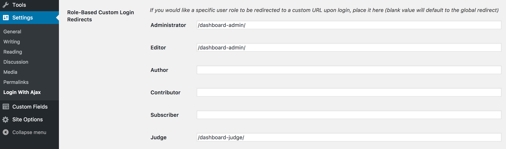
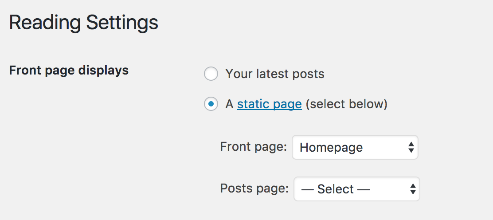
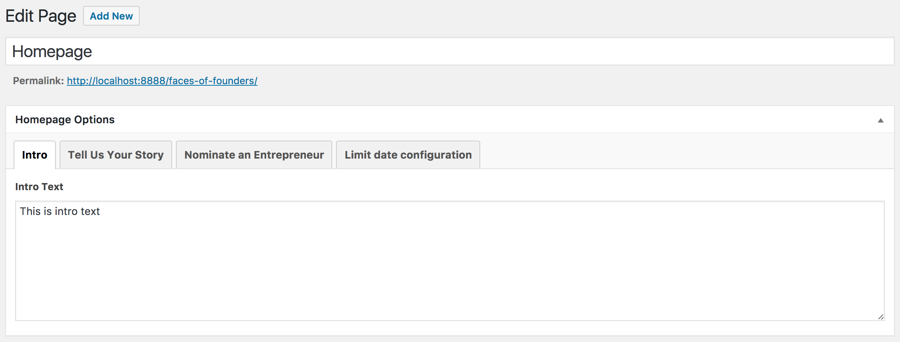
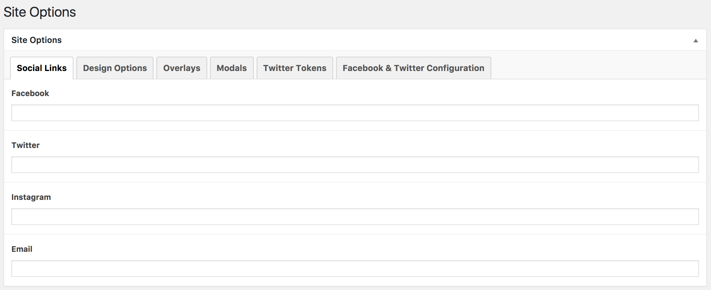
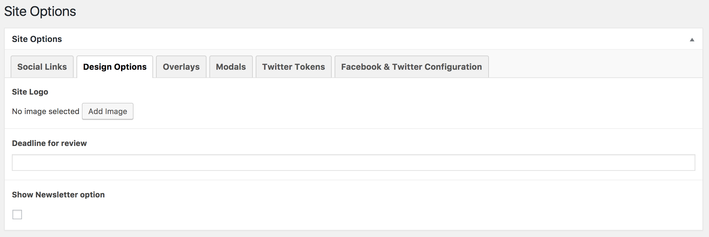
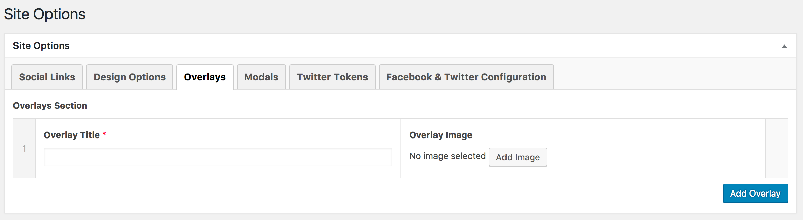
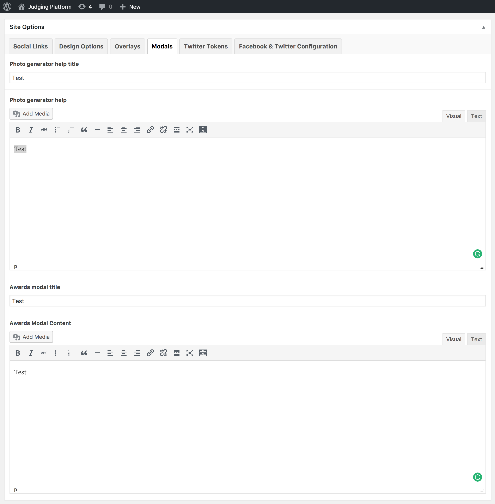
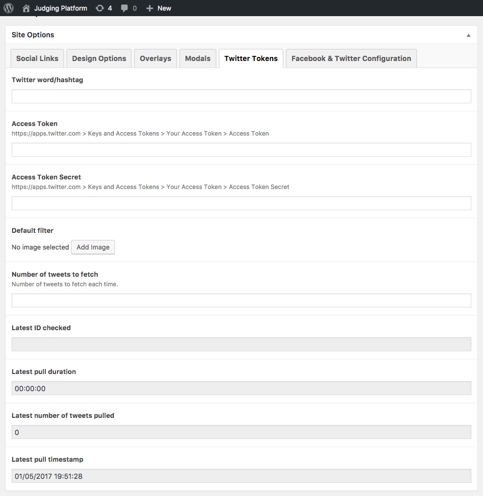
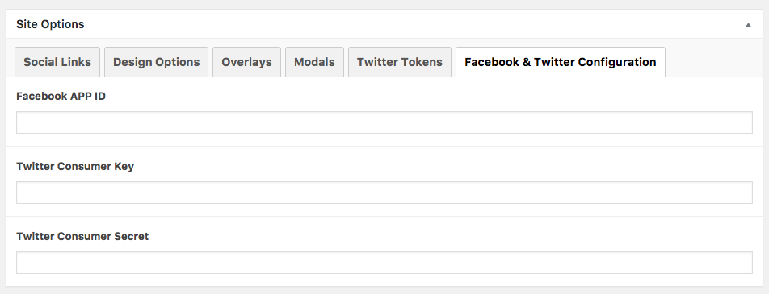

# Setup

## Table of Contents

1. [Installation](#installation)
   1. [WordPress](#wordpress)
   2. [Plugins](#plugins) 	
   3. [Theme](#theme)
2. [Configuration](#configuration)
   1. [Login With Ajax](#login-with-ajax)
   2. [Homepage Setup](#homepage-setup)
   3. [Site Options](#site-options)

## Installation

### WordPress

Because this is a WordPress theme, it requires a full WordPress instance to function. To set up WordPress, visit the [download page](https://wordpress.org/download/) and follow the installation guide, or follow your hosting provider's WordPress-specific installtion instructions.

### Plugins

The theme requires two plugins to be installed prior to setup. After installing WordPress, install the following plugins by following each one's setup instructions:

1. [Advanced Custom Fields PRO](https://www.advancedcustomfields.com/)
2. [Login With Ajax](http://wordpress.org/extend/plugins/login-with-ajax/)

### Theme

After WordPress is running with the required plugins, download the folder containing this code into the `wp-content/themes` directory so that it contains a folder named `judging-platform`. The easiest way to do this is to download the ZIP archive from GitHub or check out the project using Git:

```
# cd wp-content/themes
# git clone https://github.com/casefoundation/judging-platform.git
```

## Configuration

With everything installed, a few configurations must be manually applied:

### Login With Ajax



Configure Login With Ajax by going to the WordPress dashboard and clicking _Settings_ and then _Login with Ajax_ from the sidebar. On the settings screen, under _Role-Based Custom Login Redirects_, set the _Administrator_ and _Editor_ fields to `/dashboard-admin/` and the _Judge_ field to `/dashboard-judge`.

### Homepage Setup

The theme automatically creates the required pages (Dashboard Admin, Dashboard Judge, Login and Review Story) and assigns its template to each page, it is important that these pages are not deleted.



Create a page and configure it as homepage, for that go to _Settings_ and then _Reading_ from the WordPress dashboard and select the option _A static page (select below)_ and in the _Front Page_ dropdown choose the page you created.



Now that page has new fields for the operation of the home page.

### Site Options

The rest of the site is configurable from the _Site Options_ link in the sidebar of the WordPress dashboard.

#### Social Links



In this section you can enter the url of your social networks like Facebook, Twitter, Instagram and Email.

#### Design



These fields control options on the homepage for the site's logo, banner text that provides a submission deadline, and an option to control the email signup box that appears when visitors submit their photos.

#### Overlays



Overlays are the images that visitors may choose to apply to their uploaded photo. All overlay images should be 300x300 pixels, and there must be at least two active overlays for the site to function properly.

#### Modals



On the homepage, there are two help modals that appear upon user request. Set the text for those prompts here.

#### Twitter Tokens



To also accept submissions via the Twitter API, setup a hashtag to monitor as well as a Twitter OAuth token and secret. The site will run a cron job that queries Twitter based on those credentials and hashtag and apply the specified overlay. (Also a 300x300 pixel image.) To setup a Twitter app with the appropriate credentials, visit [apps.twitter.com](https://apps.twitter.com/).

#### Facebook & Twitter Configuration



To power the Twitter API query as well as the Twitter and Facebook login buttons from the homepage, also specific the Twitter consumer key and secret and Facebook App ID here.
