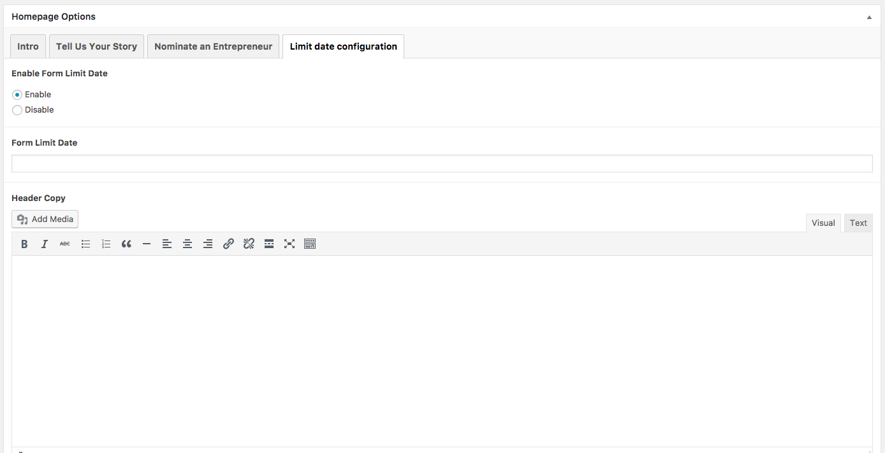
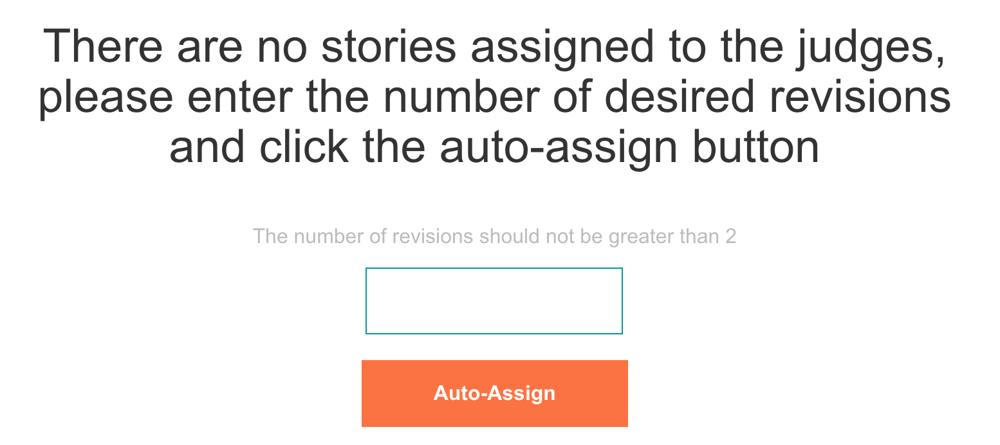
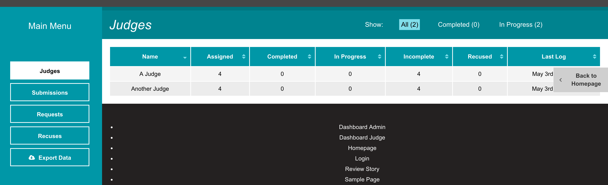
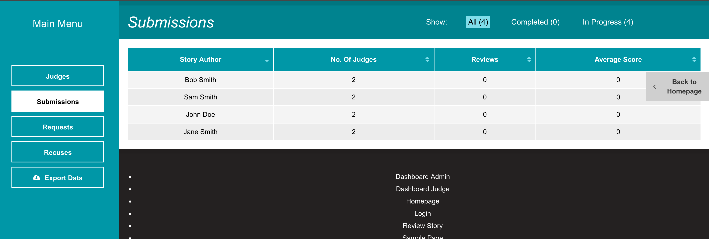
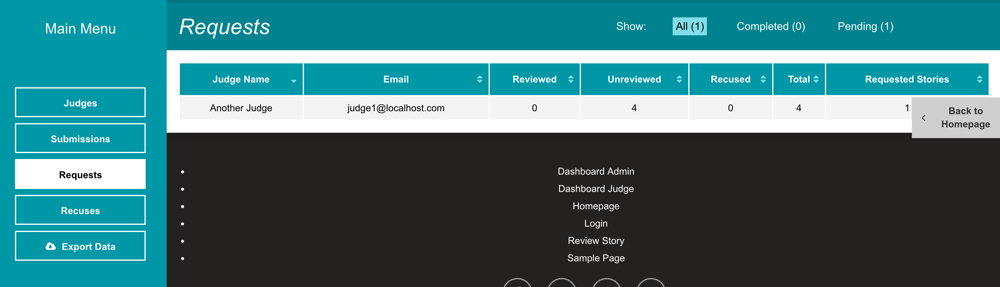
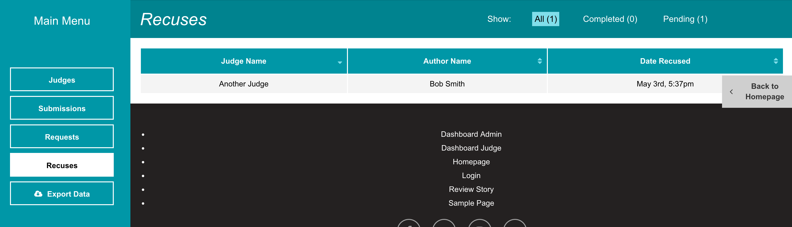
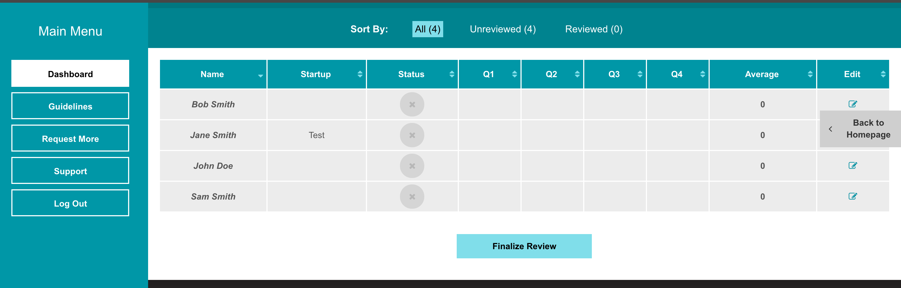
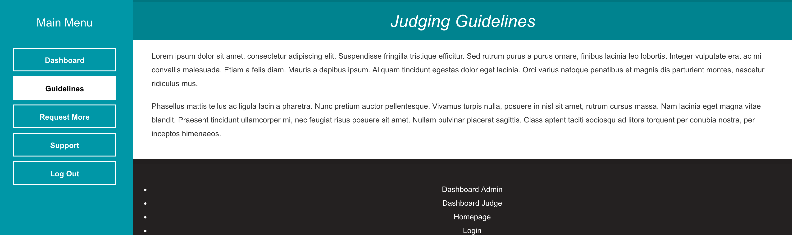
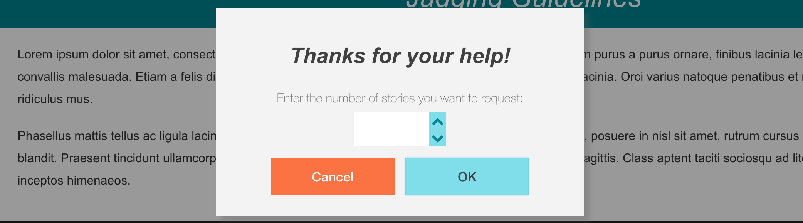
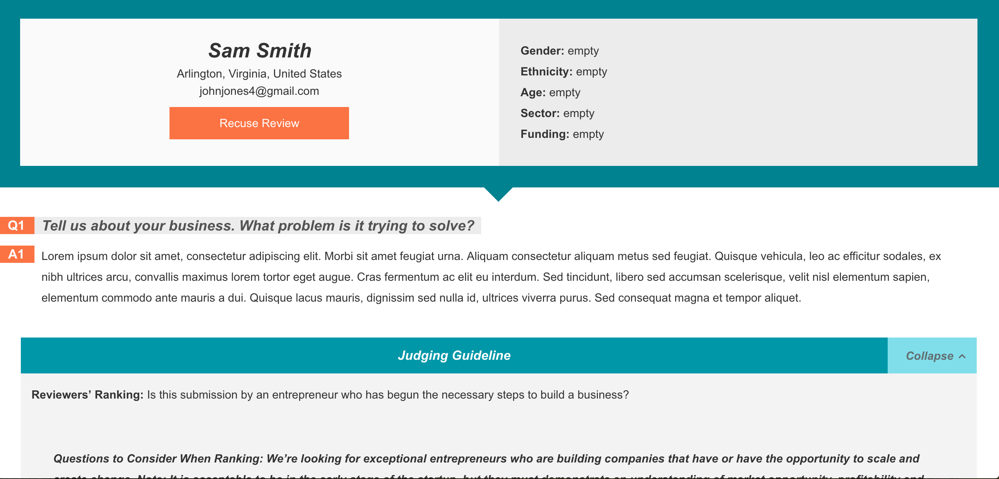

# Use

## Table of Contents

1. [Closing Submissions](#closing-submissions)
2. [Adding Judges](#adding-judges)
3. [Interacting With The Dashboard As An Admin](#interacting-with-the-dashboard-as-an-admin)
   1. [First Run](#first-run)
   2. [Judges](#judges)
   3. [Submissions](#submissions)
   4. [Requests](#requests)
   5. [Recusals](#recusals)
   6. [Export](#export)
4. [Interacting With The Dashboard As A Judge](#interacting-with-the-dashboard-as-an-judge)
   1. [Dashboard](#dashboard)
   2. [Guidelines](#guidelines)
   3. [Request More](#request-more)
   4. [Support](#support)
   5. [Submission Review](#submission-review)
5. [Manually Adding or Modifying Stories](#manually-adding-or-modifying-stories)

## Closing Submissions

When ready to begin use of the judging platform, an admin must set the site configuration to no longer accept further submissions. To do this, edit the _Homepage_ by going to _Pages_ from the WordPress dashboard and selecting _Homepage_ from the list. On the edit screen, select the tab titled _Limit date configuration_ where there is an option to enable a limit date. Past that date, the system will disable the photo upload tool and submission form so that visitors may no longer submit content.

## Adding Judges

To add new judges, an admin should create a new WordPress user by going to _Users_, _Add New_ from the WordPress dashboard. The admin should make sure to set the new user's role to _Judge_. When users with the role of _Judge_ login, WordPress automatically directs them to the `/dashboard-judge/` page where they can begin interacting with the platform.

## Interacting With The Dashboard As An Admin

### First Run

Upon visiting `/dashboard-admin/` for the first time, admins must assign stories to the judges. The term _revisions_ refers to how many judges will see a submission, in this case a submission can go through 1 or 2 judges.

### Judges

Once inside the admin dashboard, the first view an admin sees is the status of the judges. The table details the review status of each judge and his or her last login time.

### Submissions

In the dashboard is also a status view for submitted stories. The table details how many judges are assigned to each story, the review status of each story, and each story's average score.

### Requests

If a judge requests more stories to review by using the [Request More](#request-more) tab in the judge's dashboard, his or her request appears here. To approve the request, click the row and choose to either reassign stories already assigned to other judges or to assign stories that other judges have recused themselves from.

### Recusals

When a judge recuses his or herself from a story, the recusal record appears in this table.

### Export

All data in the dashboard may be downloaded as a CSV file.

## Interacting With The Dashboard As A Judge

### Dashboard

Upon login as a judge, WordPress takes the user to the specialized `/dashboard-judge/` page. On the initial dashboard, a judge will see the submissions in his or her queue for review. To learn more about how individual submission reviews work, see [Submission Review](#submission-review) below.

### Guidelines

This tab is open space to provide judges with guidelines for their review. An admin may change the text of this page by editing the _Dashboard Judge_ from the  _Pages_ section of the Wordpress dashboard.

### Request More

If a judge wishes to review more submissions, he or she may do so by requesting more and specifying an amount to request. That request appears for admins under the [Requests](#requests) tab in the admin dashboard.

### Support

A judge may request support from within the judge's dashboard by clicking this link. It is a `mailto:` link addressed to the WordPress site admin email address.

### Submission Review

For each submitted story, a judge can view and score each of the respondent's answers. The system uses the aggregate of these scores to determine rankings. If the judge must recuse his or herself from reviewing a particular submission, there is a _Recuse Review_ at the top of the page that will remove the story from the judge's queue and make it available for another judge to review. The recusal also appears on the admin [Recusals](#recusals) tab.

## Manually Adding or Modifying Stories

To add a new submission manually, go to _Stories_ and then _Add New_ from sidebar in the WordPress dashboard. From there, the same fields are available that are available on the front end to submitting users.

To modify a previously submitted story, go to _Stories_ from the sidebar of the WordPress dashboard. From there, use the table and WordPress searching/filtering tools to locate the proper story. Click the title/name of submitter to go to the edit screen.
